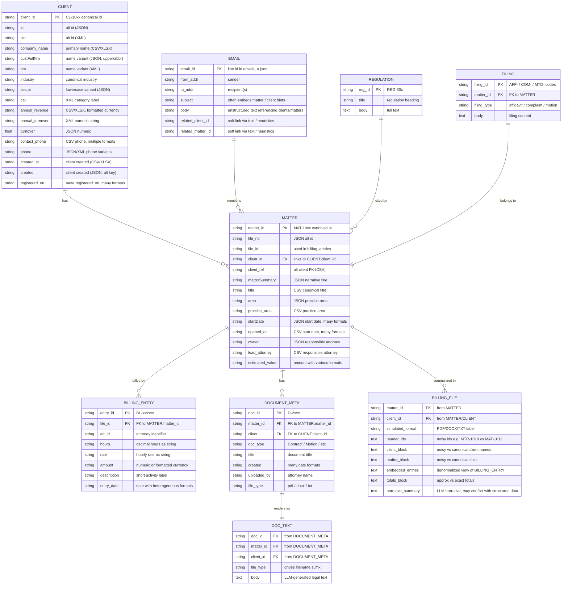

## Heterogeneous Legal Dataset – Logical Data Model (Mermaid)

Below is a detailed view of the core entities, their key fields (including heterogeneous representations), and relationships.  
This focuses on the **scaled pack** but is also compatible with the smaller original pack.

### How to read this model

- **CLIENT**: Same real-world entity appears under multiple field names (`client_id`, `id`, `cid`, `custFullNm`, etc.), across CSV/JSON/XML/XLSX, with **value‑level inconsistencies** for revenue, phone, and dates.
- **MATTER**: Links to a single canonical client but exposes **id + date + value variations** (`matter_id` vs `file_no` vs `file_id`; `startDate` vs `opened_on`; different estimated value formats).
- **BILLING_ENTRY**: Normalized line‑items keyed by `file_id` → `MATTER.matter_id`; amounts and dates intentionally stored with mixed formats and occasional nulls.
- **DOCUMENT_META → DOC_TEXT**: Metadata row plus one or more text files; text is generated via LLM and may introduce **semantic drift** relative to structured fields.
- **BILLING_FILE**: Per‑matter narrative dossier that denormalizes and **adds noise** to CLIENT/MATTER/BILLING_ENTRY (id aliasing, drifted names/titles, approximate totals).
- **EMAIL / REGULATION / FILING**: Additional unstructured/semistructured sources that reference CLIENT/MATTER either via hard FK (`matter_id`) or via soft textual hints; useful for entity‑resolution and cross‑source fusion.

Use this diagram as the orchestration blueprint: ingest each entity type, normalize identifiers (client/matter ids), then layer value normalization (dates, phones, currency) and semantic alignment (titles, descriptions, narratives) on top.

